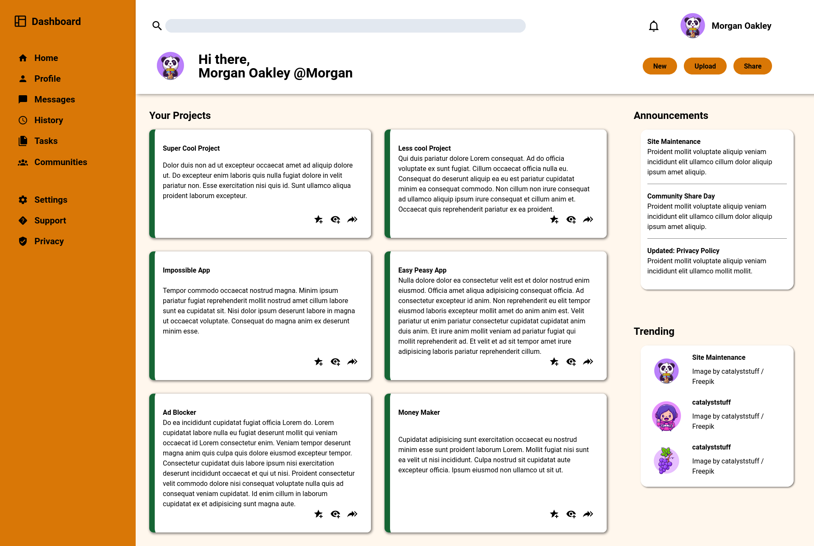

# Admin Dashboard Project 
This project is made for the odin course Intermediate html and css course.
## Concepts used on this project
- Grid Positioning
- Importing and using svg as icons
- Importing and using custom fonts

Link to the course: [Odin Admin dashboard Project](https://www.theodinproject.com/lessons/node-path-intermediate-html-and-css-admin-dashboard)
 Link to the finished page: [Github-Pages](https://joseozuna48.github.io/admin-dashboard-css/)

## Finished Page

## Example page from the course
